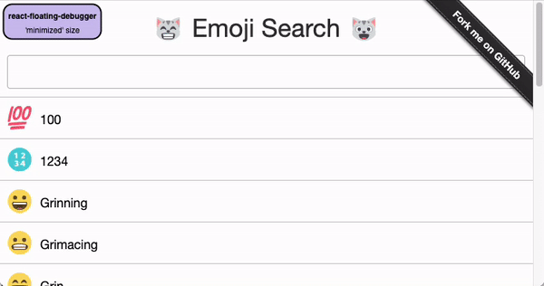

# react-floating-debugger

[](https://www.npmjs.com/package/react-floating-debugger)

Lightweight floating container for react apps



<span style="font-size: 12px; font-style: italic;">(Source for 'emoji search' example app can be found at https://github.com/ahfarmer/emoji-search)</span>

## Live Demo
https://stackblitz.com/edit/react-floating-debugger-demo

## Features

- Easily accessible in the UI
- 3 sizes ('minimized', 'in corner' and 'maximized')
- Pins to one of the four window corners
- Remembers state (position and accordion open/closed states for individual entries)
- Simple conditional rendering (for instance hide it on production)

## Technical highlights

- fully written in TypeScript
- customizable

## Install

```
npm install --save react-floating-debugger
```

Or if you use Yarn:

```
yarn add react-floating-debugger
```

## Usage

Detailed documentation coming soon.
Example usages (as shown in video/gif above) would be...

```tsx
<MyMainApp>
  <SomeAppContent />
  <ReactFloatingDebugger show>
    <div>
      some custom content to display for every size of the
      react-floating-debugger
    </div>
  </ReactFloatingDebugger>
</MyMainApp>
```

...or the following (which would represent what can be seen in the video/gif above):

```tsx
<MyMainApp>
  <SomeAppContent />
  <ReactFloatingDebugger
    show={process.env.NODE_ENV !== "production"}
    screenWidth={"100vw - 17px"}
    bgColor={"#cdc2ef"}
  >
    {(size) => {
      if (size === "MINIMIZED") {
        return (
          <div style={{ fontSize: 10, margin: 5, textAlign: "center" }}>
            <h1 style={{ fontSize: 10, fontWeight: "bold" }}>
              react-floating-debugger
            </h1>
            <div>'minimized' size</div>
          </div>
        );
      } else if (size === "IN_CORNER") {
        return (
          <div style={{ textAlign: "center" }}>
            <h1 style={{ fontSize: 16, fontWeight: "bold" }}>
              react-floating-debugger
            </h1>
            <div>'in corner' size</div>
            <p>show some more details here :)</p>
          </div>
        );
      } else {
        return [
          <div style={{ textAlign: "center" }}>
            <h1 style={{ fontSize: 24, fontWeight: "bold" }}>
              react-floating-debugger
            </h1>
            <div>'maximized' size</div>
            <p>show even more details here</p>
          </div>,
          {
            title: "1st accordion entry",
            content: <div>1st accordion entry's content...</div>,
          },

          {
            title: "2nd accordion entry",
            content: <div>2nd accordion entry's content...</div>,
          },
        ];
      }
    }}
  </ReactFloatingDebugger>
</MyMainApp>
```

## Open Tasks / Ideas

- add proper documentation for usage, props, etc.
- add storybook for development
- tbc.
